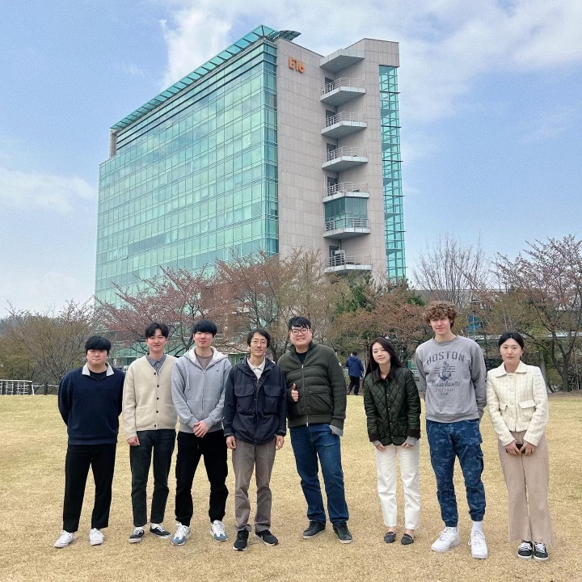

# This page has information about me

* I am currently pursuing a Master's degree in Epidemiology at Columbia University with a strong interest in the fields of aging and Alzheimer's disease

* I spent three years in a biology physics laboratory, working on the Tau protein, which is a known causative factor in Alzheimer's disease. My professor and colleagues greatly inspired me during my time as a research assistant. This experience has fueled my desire to pursue a Master's degree in Epidemiology, with a particular focus on the study of aging and chronic diseases.

